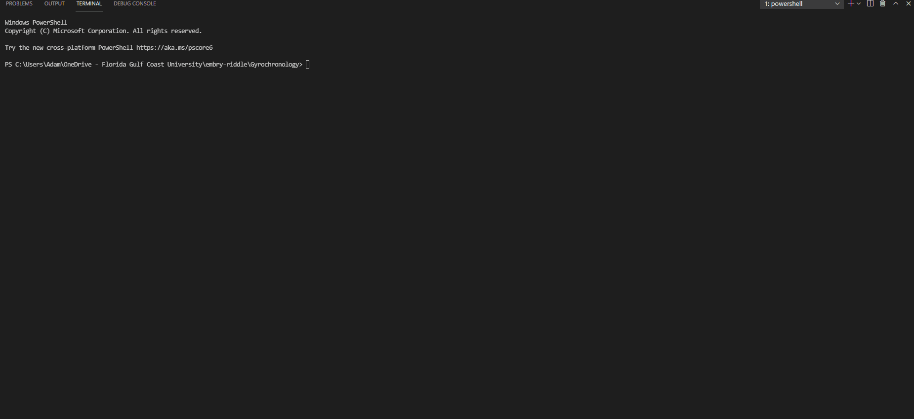

# Period Analysis   
Period Analysis program written as a part of the Gyrochronology research partnership between 
Florida Gulf Coast University and Embry-Riddle Aeronautical University.
- Create automated method of finding rotation periods from observation data.
- Analyze time series from K2 and TESS observations and pass through period analysis pipeline.
- Implmement four period finding algorithms:
    - Lomb-Scargle
    - Autocorrelation Function
    - Wavelet Transformation
    - GPS

## Demonstration

## Getting Started
### Dependencies
- Python 3.6 or newer
- NumPy
- Astropy
- SciPy
- Scaleogram
- Matplotlib
- PyWavelet
- aaren wavelets (https://github.com/aaren/wavelets)
Run period_analysis.py with the above packages installed on your system. Ensure correct pathing of test file.

## Contributing
- Convert command line interface to GUI
- Optimize wavelet function - runs too slowly. (change package?)
- Verify uncertainty implementation and accuracy.
- GPS/Paul unfinished?
- Fix windowing on output graphs. Properly show the peak, as well as uncertainty window.
- Continue testing on different fits files.

## Authors
- Adam Dressel
- Dory Mauretour
- Dr. Derek Buzasi

## Acknowledgements
- https://numpy.org/
- https://www.astropy.org/
- https://www.scipy.org/
- https://github.com/aaren/wavelets